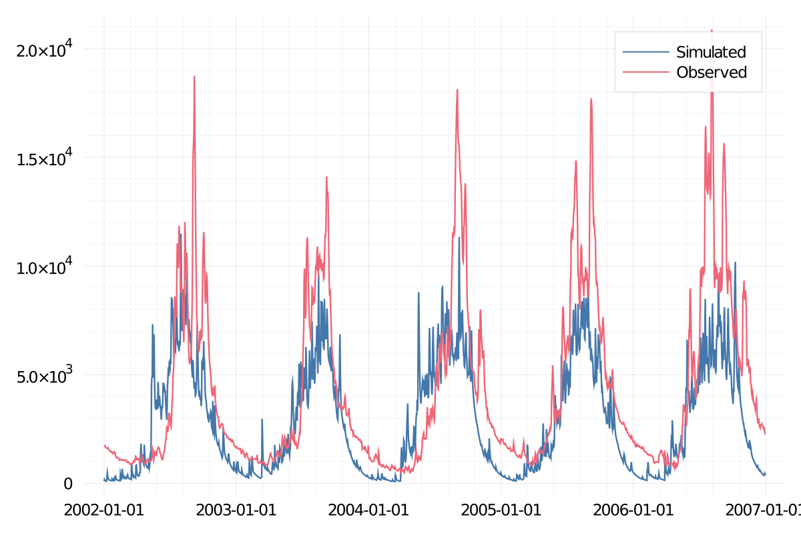

# HYMOD.jl
HYMOD model implementation in Julia

Simple package with functionality to calibrate/simulate river dischage with the Hymod model.

## Installation
The Hymod package is not yet registered on the Julia pacakge repo. For now, you can install Hymod.jl from the GitHub repo.

```
julia> Pkg.add(PackageSpec(url="https://github.com/JuliaHydro/Hymod.jl"))
```


## Example use

```julia
using HTTP, CSV, DataFrames, Hymod

# define url to test data
testDataUrl = "https://raw.githubusercontent.com/JuliaHydro/Hymod.jl/master/test/data/test_forcings.csv"
# get response
response = HTTP.get(testDataUrl)

# read response as a DataFrame
df = CSV.File(response.body) |> DataFrame

# create a column in the data frame for potential evapotranspiration
df[:pet] = hargreaves(df,tminCol=:tmin,tmaxCol=:tmax,dtCol=:date)

# get a random set of parameters
pars = randomparams()

# run a simulation
q = simulate(df,precipCol=:precip, petCol=:pet; pars...)
```

### Calibrating a model

```julia
using Dates

# define dates to calibrate
calStart = Date(1986,1,1)
calEnd = Date(2001,12,31)

# filter dataframe between start and end calibration times
calDf = filter(row -> row[:date] >= calStart && row[:date] <= calEnd, df)

# get a dictionary of parameter ranges
paramSpace = Dict(
    :cmax => Dict(:lower => 1.0, :upper => 100),
    :bexp => Dict(:lower => 0.0, :upper => 2.0),
    :alpha => Dict(:lower => 0.2, :upper => 0.99),
    :ks => Dict(:lower => 0.01, :upper => 0.5),
    :kq => Dict(:lower => 0.5, :upper => 1.2)
)

# set number of iterations to run calibration
nIterations = 5000

# run calibration
calQ, calPars, calLoss = calibrate(calDf,paramSpace,nIterations)

# get the remainder of dataframe to test calibrated parameters
testDf = filter(row -> row[:date] > calEnd, df)
# run simulation with calibrated parameters
testDf[:q] = simulate(testDf,precipCol=:precip, petCol=:pet; calPars...)

```

When you plot the simulated results compared to observed values, you should get a plot similar to one below.


